# F1 — Auth & Authorization

**Entry points:** `src/pages/LoginPage.tsx:28`, `worker/src/index.ts:211–405`

```mermaid
flowchart TD
    Start(["User Visits LoginPage\nsrc/pages/LoginPage.tsx:28"]) --> InitAuth["useAuthStore.init\nsrc/store/authStore.ts:29"]
    InitAuth --> CheckToken["getStoredToken\nsrc/services/auth.ts:7"]
    CheckToken --> ValidateToken["isTokenValid\nsrc/services/auth.ts:28"]
    ValidateToken -->|Valid| ParseToken["parseJwt\nsrc/services/auth.ts:19"]
    ParseToken --> SetAuthState["set user + token state\nsrc/store/authStore.ts:34"]
    ValidateToken -->|Invalid/None| ClearToken["clearToken\nsrc/services/auth.ts:15"]
    ClearToken --> LoadComplete["isLoading = false\nsrc/store/authStore.ts:51"]
    SetAuthState --> CheckAlreadyLoggedIn["Check if user exists\nsrc/pages/LoginPage.tsx:68"]
    CheckAlreadyLoggedIn -->|Yes| RedirectDash["Navigate /dashboard\nsrc/pages/LoginPage.tsx:58"]
    LoadComplete --> RenderLoginUI["Render LoginPage UI\nsrc/pages/LoginPage.tsx:131"]

    RenderLoginUI --> ChooseFlow{Auth Method}

    subgraph GitHubFlow["GitHub OAuth"]
        GitHubStart["Click 'Continue with GitHub'\nsrc/pages/LoginPage.tsx:152"]
        GitHubRedirect["window.location.href = /auth/github/login\nsrc/pages/LoginPage.tsx:152"]
        GitHubAuth["GET github.com/login/oauth/authorize\nworker/src/index.ts:213"]
        GitHubCallback["GitHub callback\nworker/src/index.ts:220"]
        TokenExchange["POST github.com/.../access_token\nworker/src/index.ts:224"]
        FetchGHUser["GET api.github.com/user\nworker/src/index.ts:232"]
        CheckPublicEmail{"ghUser.email?\nworker/src/index.ts:238"}
        FetchEmails["GET api.github.com/user/emails\nworker/src/index.ts:240"]
        UpsertGH["upsertUserKv\nworker/src/index.ts:249"]
        SignGHJwt["signJwt + redirect /login?token=\nworker/src/index.ts:261"]
        GHOAuthCallback["params.get('token')\nsrc/pages/LoginPage.tsx:43"]
        SetGHAuth["setAuth user+token\nsrc/pages/LoginPage.tsx:48"]
        GHSuccess["Navigate /dashboard\nsrc/pages/LoginPage.tsx:58"]
        GitHubStart --> GitHubRedirect --> GitHubAuth --> GitHubCallback --> TokenExchange --> FetchGHUser --> CheckPublicEmail
        CheckPublicEmail -->|Not public| FetchEmails --> UpsertGH
        CheckPublicEmail -->|Public| UpsertGH
        UpsertGH --> SignGHJwt --> GHOAuthCallback --> SetGHAuth --> GHSuccess
    end

    subgraph GoogleFlow["Google OAuth"]
        GoogleStart["Click 'Continue with Google'\nsrc/pages/LoginPage.tsx:144"]
        GoogleRedirect["window.location.href = /auth/google/login\nsrc/pages/LoginPage.tsx:144"]
        GoogleAuth["GET accounts.google.com/o/oauth2/v2/auth\nworker/src/index.ts:275"]
        GoogleCallback["Google callback\nworker/src/index.ts:278"]
        GoogleTokenExchange["POST oauth2.googleapis.com/token\nworker/src/index.ts:282"]
        FetchProfile["GET googleapis.com/oauth2/v3/userinfo\nworker/src/index.ts:296"]
        UpsertGoogle["upsertUserKv\nworker/src/index.ts:303"]
        SignGoogleJwt["signJwt + redirect /login?token=\nworker/src/index.ts:315"]
        GoogleCallback2["params.get('token')\nsrc/pages/LoginPage.tsx:43"]
        SetGoogleAuth["setAuth user+token\nsrc/pages/LoginPage.tsx:48"]
        GoogleSuccess["Navigate /dashboard\nsrc/pages/LoginPage.tsx:58"]
        GoogleStart --> GoogleRedirect --> GoogleAuth --> GoogleCallback --> GoogleTokenExchange --> FetchProfile --> UpsertGoogle --> SignGoogleJwt --> GoogleCallback2 --> SetGoogleAuth --> GoogleSuccess
    end

    subgraph EmailLoginFlow["Email Login"]
        EmailLoginStart["mode='login'\nsrc/pages/LoginPage.tsx:33"]
        ValidateEmailForm["Check email && password\nsrc/pages/LoginPage.tsx:74"]
        EmailLoginFetch["POST /auth/email/login\nsrc/pages/LoginPage.tsx:98"]
        GetIP["CF-Connecting-IP header\nworker/src/index.ts:365"]
        CheckAttempts{"failed >= 5?\nworker/src/index.ts:370"}
        FetchStoredUser["KV.get user_email\nworker/src/index.ts:373"]
        HashInputPW["hashPassword\nworker/src/index.ts:380"]
        CompareHash{"hashes match?\nworker/src/index.ts:382"}
        UpdateLastActive["KV.put user_email updated\nworker/src/index.ts:392"]
        SignEmailJwt["signJwt email user\nworker/src/index.ts:403"]
        SetEmailAuth["setAuth user+token\nsrc/pages/LoginPage.tsx:112"]
        EmailSuccess["Navigate /dashboard\nsrc/pages/LoginPage.tsx:113"]
        EmailLoginStart --> ValidateEmailForm --> EmailLoginFetch --> GetIP --> CheckAttempts
        CheckAttempts -->|No| FetchStoredUser --> HashInputPW --> CompareHash
        CompareHash -->|Match| UpdateLastActive --> SignEmailJwt --> SetEmailAuth --> EmailSuccess
        CheckAttempts -->|Yes 429| RateLimitErr["errorRes 429\nworker/src/index.ts:370"]
        CompareHash -->|Mismatch| FailedAttempt["KV.put attemptKey +1\nworker/src/index.ts:383"]
    end

    subgraph EmailRegisterFlow["Email Register"]
        EmailRegStart["Click 'Create one'\nsrc/pages/LoginPage.tsx:241"]
        ValidateRegForm["Validate name/email/password\nsrc/pages/LoginPage.tsx:78-90"]
        EmailRegFetch["POST /auth/email/register\nsrc/pages/LoginPage.tsx:98"]
        CheckExisting{"user exists in KV?\nworker/src/index.ts:331"}
        HashRegPW["hashPassword\nworker/src/index.ts:334"]
        CreateUserRecord["KV.put user_email\nworker/src/index.ts:336"]
        SignRegJwt["signJwt new user\nworker/src/index.ts:354"]
        SetRegAuth["setAuth user+token\nsrc/pages/LoginPage.tsx:112"]
        RegSuccess["Navigate /dashboard\nsrc/pages/LoginPage.tsx:113"]
        EmailRegStart --> ValidateRegForm --> EmailRegFetch --> CheckExisting
        CheckExisting -->|Exists 409| DupErr["errorRes 409\nworker/src/index.ts:332"]
        CheckExisting -->|New| HashRegPW --> CreateUserRecord --> SignRegJwt --> SetRegAuth --> RegSuccess
    end

    subgraph RouteGuards["Route Guards"]
        ProtectedRouteCheck["ProtectedRoute\nsrc/components/Auth/ProtectedRoute.tsx:4"]
        CheckLoading{"isLoading?\nsrc/components/Auth/ProtectedRoute.tsx:7"}
        CheckUserExists{"user exists?\nsrc/components/Auth/ProtectedRoute.tsx:15"}
        AdminRouteCheck["AdminRoute\nsrc/components/Admin/AdminRoute.tsx:4"]
        CheckAdmin{"user.isAdmin?\nsrc/components/Admin/AdminRoute.tsx:6"}
        ProtectedRouteCheck --> CheckLoading
        CheckLoading -->|Yes| ShowLoading["Show loading\nsrc/components/Auth/ProtectedRoute.tsx:10"]
        CheckLoading -->|No| CheckUserExists
        CheckUserExists -->|No| RedirectToLogin["Navigate /login\nsrc/components/Auth/ProtectedRoute.tsx:15"]
        CheckUserExists -->|Yes| AdminRouteCheck
        AdminRouteCheck --> CheckAdmin
        CheckAdmin -->|No| RedirectDashboard["Navigate /dashboard\nsrc/components/Admin/AdminRoute.tsx:6"]
        CheckAdmin -->|Yes| RenderAdmin["Render admin children\nsrc/components/Admin/AdminRoute.tsx:7"]
    end

    ChooseFlow -->|GitHub| GitHubFlow
    ChooseFlow -->|Google| GoogleFlow
    ChooseFlow -->|Email Login| EmailLoginFlow
    ChooseFlow -->|Email Register| EmailRegisterFlow
    GHSuccess --> ProtectedRouteCheck
    GoogleSuccess --> ProtectedRouteCheck
    EmailSuccess --> ProtectedRouteCheck
    RegSuccess --> ProtectedRouteCheck
```

## Side Effects
- **KV writes:** `upsertUserKv` on OAuth login (lines 249, 303); `KV.put user_email` on register (line 336); update `lastActive` on login (line 392); `KV.put attemptKey` on failed attempt (line 383)
- **localStorage writes:** `storeToken('ccxp_jwt', token)` via `setAuth` → `src/services/auth.ts:12`
- **JWT signed:** HMAC-SHA256, 30-day expiry (`worker/src/index.ts:77–93`)

## External Dependencies
- GitHub OAuth API, Google OAuth API
- Cloudflare KV (`USER_KV`)
- Web Crypto API
