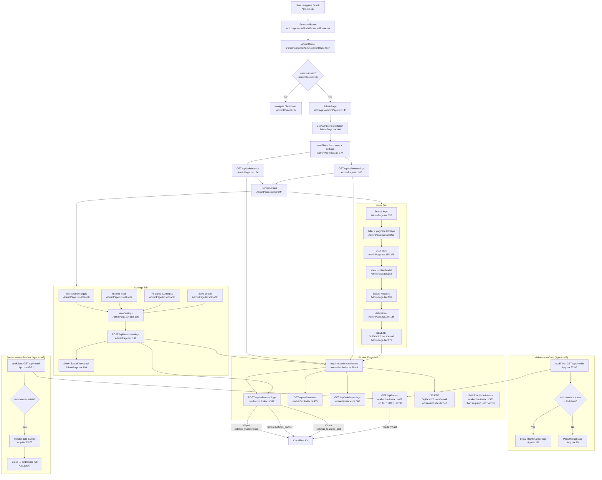

# F10 — Admin Dashboard & Analytics

**Entry points:** `src/pages/AdminPage.tsx:1`, `worker/src/index.ts:435`

## Worker Auth Requirements
| Endpoint | Auth | Location |
|----------|------|----------|
| `GET /api/health` | None | `worker/src/index.ts:409` |
| `GET /api/admin/stats` | JWT + `isAdmin` | `worker/src/index.ts:435` |
| `GET /api/admin/settings` | JWT + `isAdmin` | `worker/src/index.ts:563` |
| `POST /api/admin/settings` | JWT + `isAdmin` | `worker/src/index.ts:572` |
| `DELETE /api/admin/users/:email` | JWT + `isAdmin` | `worker/src/index.ts:540` |
| `POST /api/admin/track` | JWT only | `worker/src/index.ts:501` |

## External Dependencies
- Cloudflare KV for settings persistence
- `useAuthStore` (F1): Bearer token for all admin requests
- `POST /api/admin/track` consumed by F6 (Results) and F4 (Learning)
