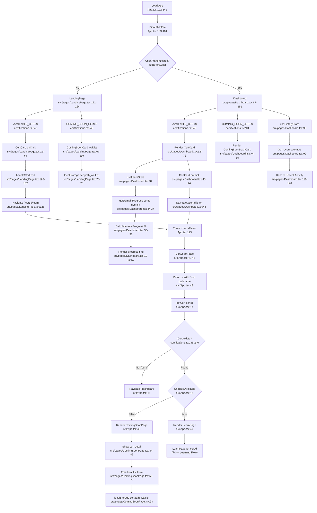

# F2+F3 — Cert Registry & Dashboard

**Entry points:** `src/data/certifications.ts:1`, `src/pages/Dashboard.tsx:1`, `src/App.tsx:42–63`

## Key Data Sources
- `isAvailable` flag: `src/data/certifications.ts:24` — single source of truth for availability
- `AVAILABLE_CERTS`: `certifications.ts:242` — filters `isAvailable === true`
- `COMING_SOON_CERTS`: `certifications.ts:243` — filters `isAvailable === false`
- Progress read from: `learnStore.getDomainProgress(certId, domain)` — `src/pages/Dashboard.tsx:34`
- Recent activity from: `historyStore.attempts` — `src/pages/Dashboard.tsx:90`

## External Dependencies
- `useLearnStore` (F4 — Learning Progress)
- `useHistoryStore` (F8 — Exam History)
- `useAuthStore` (F1 — Auth)
- `localStorage['certpath_waitlist']` — waitlist email persistence
