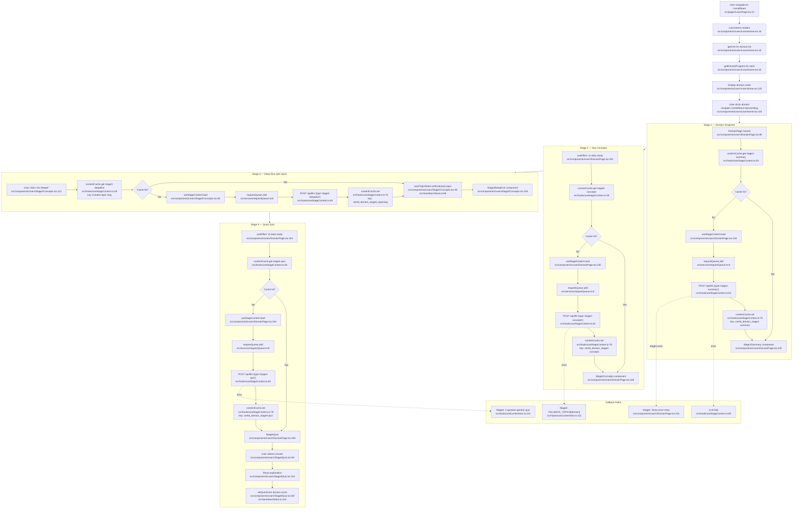

# F4 — 4-Stage Progressive Learning Flow

**Entry points:** `src/pages/LearnPage.tsx:1`, `src/components/Learn/DomainPage.tsx:80`

## Progress Write Locations
| Action | File:Line | localStorage Key |
|--------|-----------|-----------------|
| Mark topic read | `learnStore.ts:98` | `certpath_learn_progress` |
| Set quiz score | `learnStore.ts:124` | `certpath_learn_progress` |
| Progress format | `learnStore.ts:77` | key: `${certId}::${domain}` |
| Save to storage | `learnStore.ts:72` | `certpath_learn_progress` |

## Worker Endpoints
- `POST /api/llm` with `type: 'stage1-summary'` → `worker/src/index.ts:649`
- `POST /api/llm` with `type: 'stage2-concepts'` → `worker/src/index.ts:686`
- `POST /api/llm` with `type: 'stage3-deepdive'` → `worker/src/index.ts:731`
- `POST /api/llm` with `type: 'stage4-quiz'` → `worker/src/index.ts:777`

## External Dependencies
- F9 (LLM Infrastructure): `requestQueue`, `contentCache`, `callLLM`
- `activityTracker.domainStudied()` — called at `DomainPage.tsx:145`
