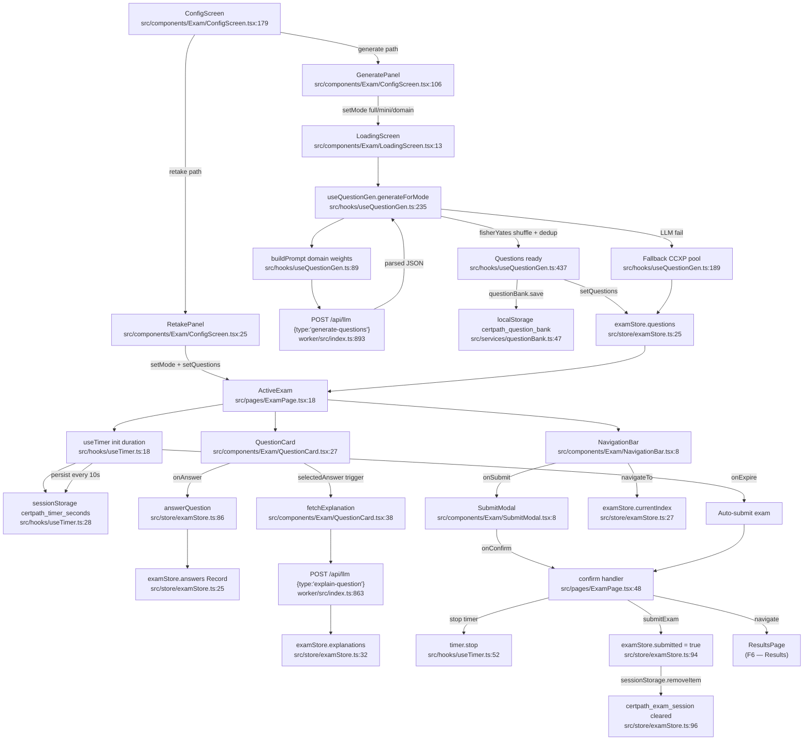

# F5 — Exam Engine (Mode + Timer + Question Generation)

**Entry points:** `src/pages/ExamPage.tsx:1`, `src/components/Exam/ConfigScreen.tsx:179`

## sessionStorage Keys
| Key | Location | Purpose |
|-----|----------|---------|
| `certpath_timer_seconds` | `useTimer.ts:28,42` | Countdown persistence (10s intervals) |
| `certpath_exam_session` | `examStore.ts:96,101` | Session marker; cleared on submit/reset |
| `certpath_retake_set_id` | `ConfigScreen.tsx:35,37` | Pre-select saved question set for retake |
| `certpath_navigate_to_topic` | `QuestionCard.tsx:65` | Navigation context exam→learn |

## localStorage Keys
| Key | Location | Purpose |
|-----|----------|---------|
| `certpath_question_bank` | `questionBank.ts:23,43` | Saved question sets for retakes |

## External Dependencies
- F9 (LLM Infrastructure): worker `/api/llm` for question generation and explanation
- F6 (Results): navigation target after submit
- `src/data/certifications.ts`: `getCert()` for domain weights
