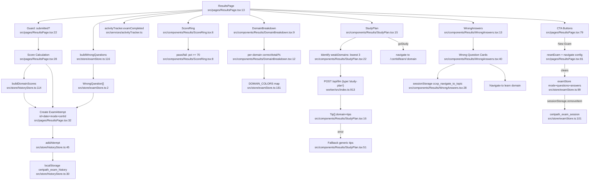

# F6 — Results & Study Plan

**Entry points:** `src/pages/ResultsPage.tsx:1`

## Exam History Write Path
1. `ResultsPage.tsx:47` → `historyStore.getState().addAttempt(attempt)`
2. Score calculated at `ResultsPage.tsx:28–30`
3. Store action: `historyStore.ts:48–52`
4. Persistence: `historyStore.ts:30` → `localStorage['certpath_exam_history']`

## sessionStorage Keys (Legacy)
| Key | Location |
|-----|----------|
| `ccxp_navigate_to_topic` | `WrongAnswers.tsx:28` — legacy, navigate wrong answer → learn |

## External Dependencies
- F5 (Exam Engine): reads `examStore` for questions/answers
- F8 (Exam History): `addAttempt` → `historyStore`
- F9 (LLM Infrastructure): worker `/api/llm` `study-plan` endpoint
- F12 (Activity Tracking): `activityTracker.examCompleted()`
