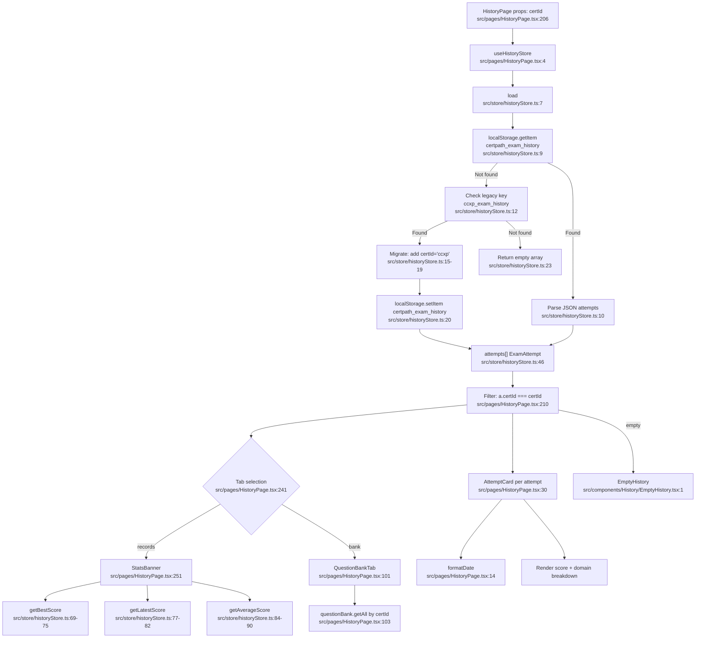

# F7 — Exam History & Analytics

**Entry points:** `src/pages/HistoryPage.tsx:206`, `src/store/historyStore.ts:7`

## Legacy Migration (Cross-Cutting Concern)
- Detected at `historyStore.ts:11–22`
- Old key `ccxp_exam_history` → migrates all records with `certId: 'ccxp'`
- One-time migration; writes to new `certpath_exam_history` key

## localStorage Keys
| Key | Location | Purpose |
|-----|----------|---------|
| `certpath_exam_history` | `historyStore.ts:9,30` | Current multi-cert exam history |
| `ccxp_exam_history` | `historyStore.ts:12` | Legacy CCXP-only history (read-then-migrate) |

## External Dependencies
- `src/services/questionBank.ts` — question bank tab reads saved sets
- `src/data/certifications.ts` — `getCert()` for cert name/icon/passing score
