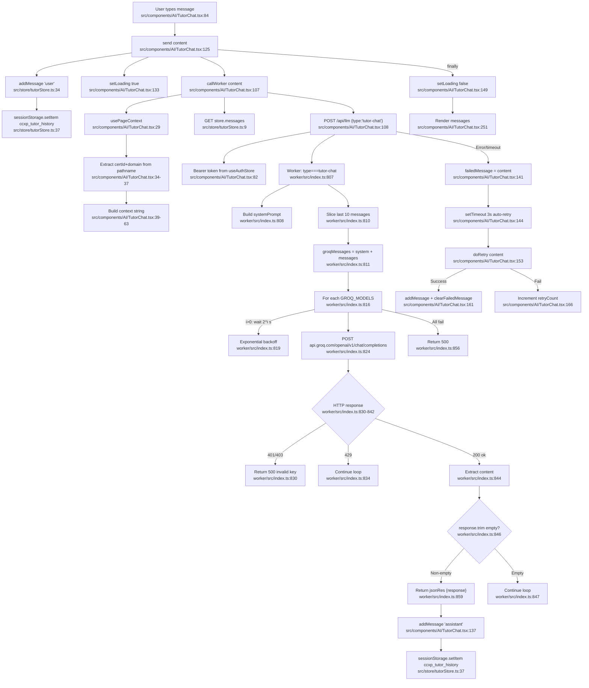

# F8 — AI Tutor Chat

**Entry points:** `src/components/AI/TutorChat.tsx:1`, `worker/src/index.ts:807`

## Context Window Management
- Last 10 messages enforced at: `worker/src/index.ts:810` — `body.messages.slice(-10)`
- Session persisted in `sessionStorage['ccxp_tutor_history']` — not cleared until browser close

## sessionStorage Keys
| Key | Location | Purpose |
|-----|----------|---------|
| `ccxp_tutor_history` | `tutorStore.ts:37` | Chat session persistence across page nav |

## External Dependencies
- F9 (LLM Infrastructure): Groq model cascade via worker
- `useAuthStore` (F1): Bearer token
- `useExamStore` (F5): Exam context for page-aware responses
