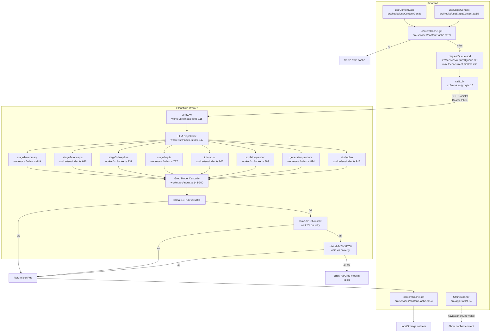

# F9 — LLM Infrastructure

**Entry points:** `src/services/groq.ts:1`, `worker/src/index.ts:606`

## localStorage Keys Written by contentCache
| Key Pattern | Set By | Notes |
|------------|--------|-------|
| `ccxp_ccxp_overview` | `useContentGen.ts:87` | Legacy domain overview |
| `ccxp_ccxp_topics` | `useContentGen.ts:106` | Legacy topic content |
| `ccxp_ccxp_flashcards` | `useContentGen.ts:133` | Legacy flashcards |
| `ccxp_ccxp_quiz` | `useContentGen.ts:161` | Legacy quiz |
| `{certId}_{domain}_stage1-summary` | `useStageContent.ts:78` | Stage 1 content |
| `{certId}_{domain}_stage2-concepts` | `useStageContent.ts:78` | Stage 2 content |
| `{certId}_{domain}_stage3_{topicSlug}` | `useStageContent.ts:78` | Stage 3 per-topic |
| `{certId}_{domain}_stage4-quiz` | `useStageContent.ts:78` | Stage 4 quiz |

## Cache Eviction Policy
- On localStorage quota hit: evict oldest 3 entries matching `*_stage*`
- Defined at: `contentCache.ts:59–75`

## Model Cascade Order
1. `llama-3.3-70b-versatile` (primary, `worker/src/index.ts:143`)
2. `llama-3.1-8b-instant` (fallback 1, wait 2s)
3. `mixtral-8x7b-32768` (fallback 2, wait 4s)
- Break immediately on 401/403 (invalid key)
- Continue on 429, 400, 5xx
