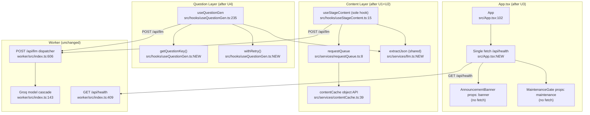

# 03 — Unified Architecture Proposal

**Generated:** 2026-05-02 | Orchestrator synthesis (Phase 3)

Addressing D1–D7 from the duplication report. D8 and D9 are intentional — no action.

---

## U1 — Single Content Hook: retire `useContentGen`, keep `useStageContent`

**Problem (D1 + D7):** Two hooks do the same job. `useContentGen` is CCXP-only, bypasses the request queue, and uses the legacy `cacheGet/cacheSet` API. `useStageContent` is cert-generic, queued, and uses the clean object API. Both are in production.

**Unified design:** Delete `useContentGen`. Every call site gets `useStageContent`.

The type mapping is:
- `useContentGen` `overview` → `useStageContent` with `type: 'stage1-summary'`
- `useContentGen` `topics` → `useStageContent` with `type: 'stage2-concepts'`
- `useContentGen` `flashcards` → no direct equivalent (stage 3 is per-topic, not a batch flashcard set)
- `useContentGen` `quiz` → `useStageContent` with `type: 'stage4-quiz'`

The flashcard case is the only gap — if any component still uses `useContentGen` for flashcards, it needs explicit mapping or a new stage type. Check `src/components/Learn/FlashcardDeck.tsx` for its current import.

**What each old call site becomes:**
```ts
// OLD (useContentGen — certId hardcoded)
const { data, loading } = useTopicsContent(domain)

// NEW (useStageContent — cert-generic)
const { data, loading } = useStageContent<Stage2Concepts>(certId, domain, 'stage2-concepts')
```

**After migration:** Remove `cacheGet`/`cacheSet` wrapper functions from `contentCache.ts:123–127`. The object API (`contentCache.get/set`) becomes the only surface.

**Loss of capability:** `useContentGen` has more verbose fallback content (multi-paragraph domain-specific statics). `useStageContent` propagates errors. Decision: move the static fallback content into `useStageContent` as a `fallbackData` parameter, or accept that the fallback UX simplifies to a retry button. The latter is acceptable — static fallback content is maintenance burden and often outdated.

---

## U2 — Shared LLM Response Parser

**Problem (D2):** `extractArray` in `useContentGen.ts:8–37` and `parseQuestions` in `useQuestionGen.ts:150–177` both strip markdown fences, handle `{data:[]}` wrapping, and recurse into `{content:""}` shapes.

**Unified design:** Extract to `src/services/llm.ts` (already exists as a thin re-export — make it earn its keep):

```ts
// src/services/llm.ts — add:
export function extractJson<T>(raw: unknown, shape: 'array' | 'object'): T | null {
  // shared logic from extractArray / parseQuestions
}
```

Call sites:
- `useContentGen.ts` → replace `extractArray(raw)` with `extractJson(raw, 'array')`
- `useQuestionGen.ts` → replace inline parsing with `extractJson(raw, 'array')`, then add domain/id injection on top

**After D1 migration:** only `useQuestionGen` remains as a caller, making this a minor cleanup.

---

## U3 — Single Health Fetch at App Root

**Problem (D6):** `AnnouncementBanner` (App.tsx:68) and `MaintenanceGate` (App.tsx:88) both `fetch('/api/health')` on mount. Two HTTP requests, one response shape.

**Unified design:** Hoist the fetch to `App`, pass results down as props:

```ts
// App.tsx
function App() {
  const [health, setHealth] = useState<HealthData | null>(null)
  useEffect(() => {
    fetch(`${WORKER_URL}/api/health`).then(r => r.json()).then(setHealth).catch(() => {})
  }, [])

  return (
    <BrowserRouter basename="/certpath-ai">
      {health?.banner && <AnnouncementBanner banner={health.banner} />}
      <MaintenanceGate maintenance={health?.maintenance ?? false}>
        ...
      </MaintenanceGate>
    </BrowserRouter>
  )
}
```

Both components become pure presentational — no `useEffect`, no `fetch`. Single network call.

**Loss of capability:** None. Health data is already read-once at mount.

---

## U4 — `getQuestionKey()` Utility + Retry Helper

**Problem (D4 + D5):** 5 inline copies of the dedup key and 2 inline copies of the retry loop, all in `useQuestionGen.ts`.

**Unified design:** Two small extractions at the top of `useQuestionGen.ts` (no new files needed):

```ts
// At top of useQuestionGen.ts
const DEDUP_KEY_LENGTH = 60
const getQuestionKey = (q: Question | string) =>
  (typeof q === 'string' ? q : q.q).trim().toLowerCase().substring(0, DEDUP_KEY_LENGTH)

async function withRetry<T>(fn: () => Promise<T>, attempts: number, delayMs: number): Promise<T | null> {
  for (let i = 0; i < attempts; i++) {
    try { return await fn() } catch {}
    if (i < attempts - 1) await new Promise(r => setTimeout(r, delayMs))
  }
  return null
}
```

Replace 5 occurrences of the dedup pattern and 2 retry loops in `useQuestionGen.ts`.

---

## U5 — Document + Fix Legacy Migration Code

**Problem (D3):** 4 files contain migration logic. The transforms differ legitimately, so no full consolidation. But two actions are needed:

**Action A — Fix potential bug:**
`src/services/contentCache.ts:25`:
```ts
// CURRENT (line 25) — may double-prefix:
const newKey = 'ccxp_' + key   // key already starts with 'ccxp_' per line 23 check
```
Audit whether this is correct or a bug. If `key` = `ccxp_CX Strategy_topics`, then `newKey` = `ccxp_ccxp_CX Strategy_topics`. Check whether that's the intended format by looking at `useStageContent.ts:78` key construction.

**Action B — Add removal TODO:**
All four migration blocks should get a comment:
```ts
// MIGRATION: Legacy CCXP→multi-cert. Safe to remove when all users on v2.0+.
// Monitor: check certpath_exam_history presence; if all traffic uses new key, delete this block.
```

---

## Unified System Flowchart



---

## What Is NOT Being Unified

- **D8 (localStorage init pattern)** — Accepted as idiomatic. No action.
- **D9 (JWT client parse vs server verify)** — Correct architecture. No action.
- **Legacy migration transforms** — Data shapes differ; full consolidation would add abstraction without simplification. Document + fix bug instead.
- **`useQuestionGen` retry** — Extracted as local helper inside the file, not a new module. 2 instances don't justify a new service.
